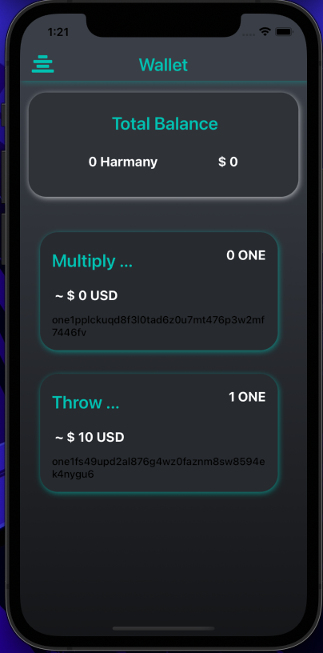
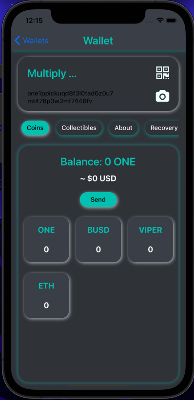
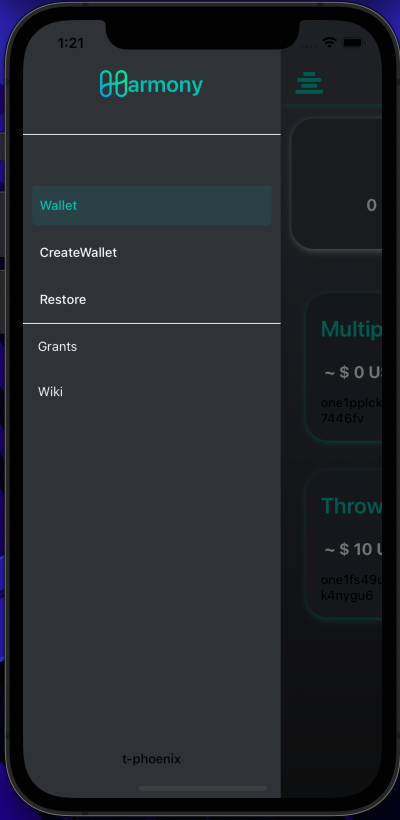

# oneWallet-Mobile
React-Native Application UI for Harmony One Wallet (iOS and android)

---

### Introduction 
- This is a User Interface (UI) for oneWallet Mobile Application (iOS and android) developed in React-Native.
- Inspired from [oneWallet.crazy.one](oneWallet.crazy.one) and neumorphism, this UI is developed to easily help users get acquainted by the mobile application.
- To align the idea of keyless signIn Google Authenticator, I've made the createWallet layout according to manual setup, instead of qr scan.
- Dynamicity in the UI is provided according to next development phase needs. (Eg. Number of Wallet Cards on Main Screen, List of different tokens inside wallet).
- 
- The biggest developer community advantage from javascript will help take this project further easily.

---

### Tools Required
- Node
- React-Native
- npm
- iOS emulator to test
- Android Emulator to test

---

### How to Run
1. clone the repository
2. npm i (install the necessary dependency)
3. npx pod-install ios (must have xcode and iOS emulator)
4. npx react-native run-ios

---

### Code Documentation
- index.js Entry File, directs towars App.js
- App.js:  Drawer Navigatior Setup to Toggle the main features of App, and usefull external links
- src: for now this folder contains the source code for the other navigations, screens, styling, components and more. It would be preferred to write the further code for Web3 Api and other screeens in this folder as subfolder or files.
  - assets: contains the svg, jpeg, png, etc. files for use in App.
  - components: Currently holds only CustomSideBar for customised Drawer Options.
  - navigation: Navigators for each of the Drawer Options to navigate in different screens among them.
  - screens: Contains the files for screens that are been handled by navigation/navigator files. These are the layout of screen that renders on the screen
  - colors.js: contain some major color codes used across the Project
  - commonStyles.js: contains some common layout and styling for react-native components.

---

### Video
YOUTUBE DEMO: [1Wallet Mobile App UI](https://youtu.be/eTTFQ_bxpV4)

---

### ScreenShots

